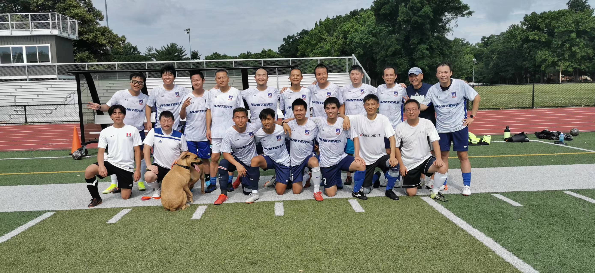

# 2022-07-02 VS 火庄 2:0

出场阵容：鹏飞，宇洋，吴强，欧阳，James，亚飞，赵康，嘉斌，Shawn，Brian，徐升，永冀，信伟，乐游，徐君，圆脸，商鹏，Joe，陈华，Kaston

进球：Kaston, 乐游

助攻：商鹏(2)

https://youtu.be/zMK4DAoBMFQ

9:42 全场第一次有威胁进攻，边路反击，商鹏带球推进，分给乐游传中，可惜没人抢到落点&#x20;

10:20 Brian断球，分给商鹏，商鹏似传似射，被Johnny把球没收

https://youtu.be/hfcOFxxmmQ0

0:42 乐游和宇洋撞墙配合，可惜直塞球给大了一些&#x20;

3:31 Kaston和商鹏配合，险些单刀，可惜被对方后卫将进攻破坏&#x20;

7:36 对方拉人犯规，不过没有被黄牌警告&#x20;

**8:26 鹏飞指挥亚飞发出去发界外球，界外球开出，商鹏出其不意连过两人，横传中路，Kaston低射破门，攻入联赛首球，开场第16分钟，猎人先拔头筹 1:0**

https://youtu.be/aRRvxK-VplQ

3:00 Kaston一个防守队员过了两遍，可惜没有配合成功&#x20;

3:56 Kaston又一次漂亮的过人，传球被对方后卫破坏&#x20;

6:11 James一次漂亮的防守&#x20;

7:05 信伟断球发动反击，Kaston直塞球稍稍传大，被Johnny出击把球没收&#x20;

8:40 对方反击打门，没有能威胁到Joe把守的大门

https://youtu.be/GK3eFh8HdbE

4:02 对方断球后打门，稍微有些威胁&#x20;

5:52 圆脸被踢到&#x20;

7:02 欧阳胸部停球很不错&#x20;

8:18 James，Kaston两次断球，小范围配合可惜没有形成威胁球

https://youtu.be/TuQ6td5Hrq8

0:23 对方边路配合，最后小角度打门被Joe轻松没收

https://youtu.be/MfJKJW7VoX0

2:08 任意球开出，宇洋前场头球摆渡，乐游接球顺势凌空打门，可惜高出&#x20;

3:10 乐游快速回撤中场断球，中路宇洋，商鹏短传配合，商鹏禁区线前一脚爆射被挡出，亚飞接球边路突破，传中又被挡出，最后Johnny把球得到&#x20;

4:58 亚飞边路断球突破，下底横传商鹏，商鹏顺势领球，可惜力度过大，被Johnny把球没收

https://youtu.be/vOz2yjMk2wQ

4:31 界外球发出，对方解围未踢远，嘉斌迎球爆射，可惜打偏&#x20;

5:36 商鹏断球，接下来右路一系列短传配合做得不错，可惜最后一传太向前了&#x20;

6:19 嘉斌界外球开出，中路商鹏一让，宇洋向后一波，亚飞接球犹豫没有及时打门，后面调整被防守队员赶上&#x20;

**7:04 对方门球开出，我们拿球反击，商鹏抢前将球分到左路，亚飞接球向前，然后横传中路，商鹏顺势打门，被Johnny挡出，对方左边后卫已经补到中路，乐游无人盯防，跟上补射得手， 2:0，下半场进行到了17分钟，这个进球帮助猎人扩大了领先优势**&#x20;

10:13 乐游接球推进反击，横传左路，亚飞接球后传出对方后卫身后球，可惜这个球不太好接，没能形成威胁&#x20;

10:48 猎人又一波反击，亚飞接球后吸引两名防守队员传出直塞球，商鹏带球和对方后卫对抗，没能形成打门

https://youtu.be/carChLwmB8s

0:21 亚飞穿挡过人，嘉斌接球被对方犯规倒地，商鹏的任意球打门很不错&#x20;

4:42 Kaston 左路接球，传球找乐游，乐游爆射被封挡，右路接球后连过两人，被第三个防守队员把球破坏&#x20;

6:00 Kaston，宇洋合力断球，Kaston将球转移到右路乐游，可惜被裁判吹罚越位，这个球传球瞬间，乐游完全不越位&#x20;

7:33 商鹏被吹罚越位，这个球看不到传球瞬间，不太清楚&#x20;

9:42 乐游界外球开出，宇洋回做，徐升第一传被挡，第二传到后点，商鹏迎球垫射，可惜打在横梁上弹出，徐升接下来的打门被Johnny得到

https://youtu.be/cz9g8xI2zgo

0:19 猎人反击，乐游带球推进，分到边路宇洋，宇洋传中被挡出，乐游迎上打门，打在对方防守队员手臂，裁判示意不构成手球犯规&#x20;

2:43 鹏飞破坏小熊进攻&#x20;

3:16 信伟边线球开出，徐升，乐游，宇洋连续短传配合，十分流畅，徐升传身后找商鹏，结果又被裁判吹越位，视频里对方最后一名后卫被挡住，无法判断&#x20;

5:20 鹏飞断球，开大脚发动反击，Johnny及时出击，阻断了猎人的反击&#x20;

5:59 Joe快速发动反击，Kaston左路接球后，形成突破被放倒，造成对手领到黄牌&#x20;

7:54 猎人发动快速反击，商鹏将球捅给Kaston，Kaston带球一路狂奔，带走对方两名后卫后传中，宇洋接球后稍微停大，顺势打门被马磊飞身挡出&#x20;

11:07 本场最后一个威胁球，对方角球开出，Joe单拳击出，商鹏倒钩踢到前面，乐游接力向前踢，Kaston带球突破，可惜被破坏

