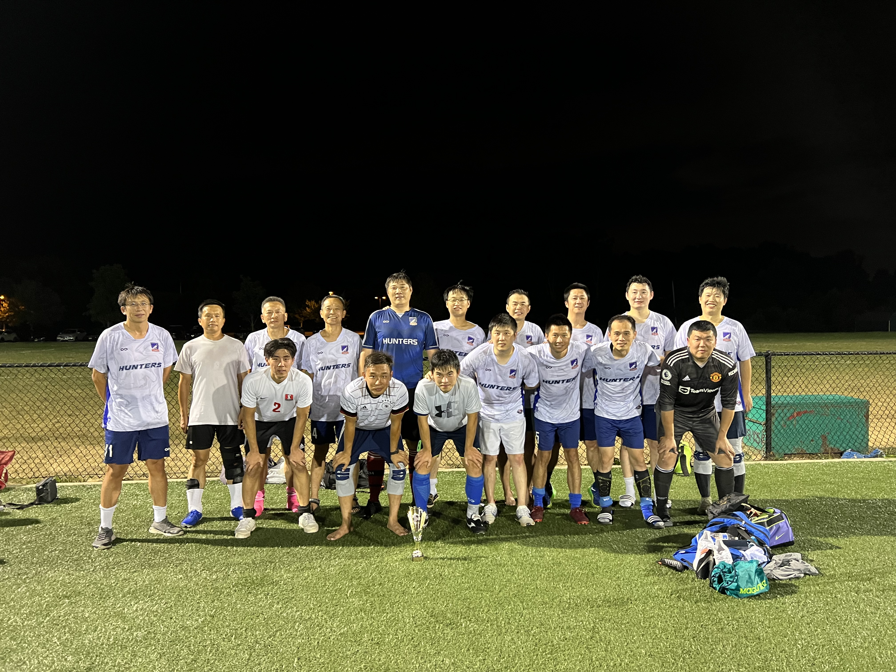

# 2022-08-06 VS 火庄 2:7

**出场阵容：亚飞，商鹏，鹏飞，Brian，嘉斌，圆脸，信伟，陈凯，Ray，乐游，宇洋，永冀，赵康，Tom，欧阳，James，白崧**

**进球：商鹏，亚飞**

**助攻：徐升**

https://youtu.be/wqszhCwcZnM 0:00&#x20;

Johnny接对方右路传中，头球破门 0:1

https://youtu.be/opsyZnXsB3w&#x20;

5:11 赵康及时抢住位置，造成小熊拉人犯规&#x20;

8:24 嘉斌中路拿球，分给边路的James， James直传中路的商鹏，商鹏顺势分给右路插上的Tom，Tom横敲找到中路的宇洋，宇洋转身分给左路的亚飞，亚飞四十五度起球找冲入禁区的Tom，可惜稍有些高，Tom没能形成攻门，这次配合感觉还是不错的&#x20;

11:56 Tom对方后场断球，球被转移给Brian后，Brian直塞，Tom顺势挑传，商鹏挑球转身后面对门将，可惜被误判越位

https://youtu.be/L\_rJdt2uchI&#x20;

0:00 猎人左路配合，转移到中路鹏飞接球，鹏飞横向打球，分给亚飞，亚飞直传受阻，应该回球给后面接应的Brian，可惜选择强行直传，球出界&#x20;

0:54 火庄中后卫长传到中场，中场两脚直塞后，对方前锋得到一对一面对鹏飞的机会，横拨后外脚背推射破门 0:2&#x20;

5:14 Brian横传Tom，Tom传身后球，信伟和对方门将拼抢，没能把球控制住&#x20;

6:58 对方断球后快速反击，又是两脚传球快速突破中场，James拉人也没能将停止对方进攻，小熊抽射破门 0:3&#x20;

8:29 对方后场传递，又是两脚传递直接打身后，小熊面对出击的欧阳挑射破门 0:4&#x20;

9:39 小朱中场断球，自己左突右闯，禁区前抽射破门 0:5 三分钟内连丢三球&#x20;

我们的进球没有能够录上，补充一下：对方后卫慌乱之中传给凯夫，凯夫传球被商鹏抢断，但是凯夫和爱队积极回防，商鹏很冷静，向右横盘带几步后，躲过了凯夫和爱队的补防将球打进 1:5

https://youtu.be/ohUghoF2R0k&#x20;

3:07 非常好的一次反击，徐升中场过度给宇洋，宇洋过顶球传给后卫身后的亚飞，可惜正好赶到逆足，趟球碰到了Johnny，这球十分可惜&#x20;

4:16 鹏飞发出任意球，被Johnny得到&#x20;

5:51 嘉斌的左侧任意球，落点极佳，可惜亚飞没能拿到球&#x20;

6:28 又丢了一球 1:6&#x20;

7:05 天黑了

https://youtu.be/cTVJTx0xoVo&#x20;

6:19 商鹏前场阻拦，对方把球踢到徐升脚下，徐升横传商鹏后前插，商鹏横拨后再传给徐升，徐升不停球挑传，亚飞禁区内凌空推射破门 2:6&#x20;

8:04 商鹏接球，强行突破数人造成犯规，乐游任意球攻门被挡出&#x20;

11:01 亚飞接左侧传球，起脚打门被Johnny获得，如果能有伊木然的技术，这球肯定能打进

https://youtu.be/mD7ehSd-JZY&#x20;

3:59 又一次绝佳机会，猎人快速反击，商鹏中场接球，分给左路插上的亚飞，亚飞不停球直接横扫门前，可惜信伟的打门没有打正&#x20;

6:39 我方犯规也没有阻止对手破门，场上比分2:7&#x20;

8:51 宇洋直塞，Ray接球后抽射破门，被判罚越位，但实际这球并没有越位，对方7号队员一直拖在后面

https://youtu.be/01uPGPp0Aq0&#x20;

2:19 鹏飞防守崴脚受伤将球截断，商鹏右路得球后，横传找到白崧，白崧打门被Johnny用脚挡出&#x20;

3:57 James长传转移找到Tom， Tom一对二，没能形成打门&#x20;

7:38 商鹏右路得球分球给欧阳，欧阳横传，亚飞左路接球转身打门偏出&#x20;

10:37 徐升中路拼抢受伤

